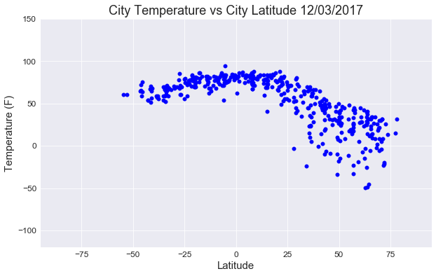
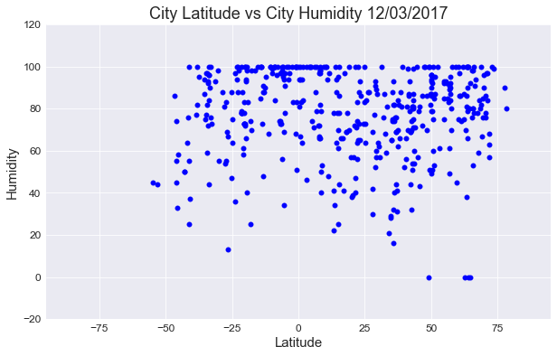
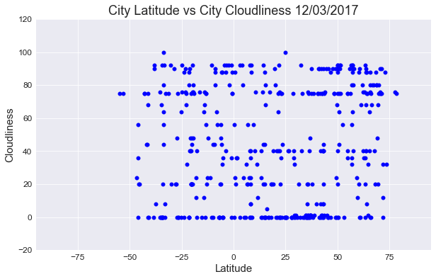
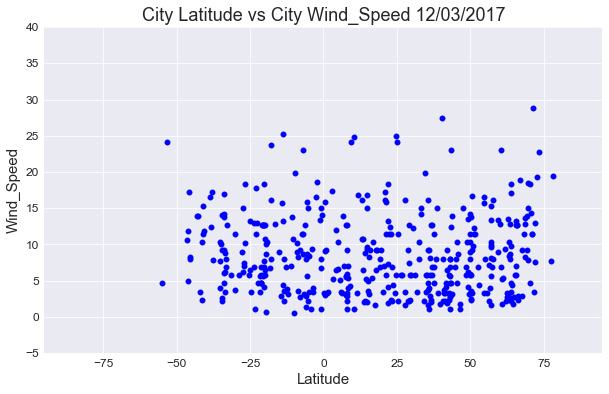

```python
Observed Trend 1: Temperature of the cities near the equator are comparetively high
Observed Trend 2: more cities on the north of the equator seem to be cloudy than the cities below the equator
Observed Trend 3: wind_speeds seem to be low during this time of the year
```


```python
import requests as req
import json
import pandas as pd
import numpy as np
import seaborn as sns
from citipy import citipy
import matplotlib.pyplot as plt
from datetime import datetime
```


```python
#get date info
date = datetime.today()
cur_date = date.strftime('%m/%d/%Y')
```


```python
#get city name
lat = []
n = range(-90,90,7)
m = range(-180,180,9)

for row in n:
    for col in m:

        city = citipy.nearest_city(row, col)
        name = city.city_name
       
        
        if name not in lat:
            lat.append(name)
```


```python
#convert to dataframe
lat_df = pd.DataFrame(lat)
lat_df = lat_df.rename(columns={ 0 :"cities"})
lat_df.head()
```


<div>
<style>
    .dataframe thead tr:only-child th {
        text-align: right;
    }

    .dataframe thead th {
        text-align: left;
    }

    .dataframe tbody tr th {
        vertical-align: top;
    }
</style>
<table border="1" class="dataframe">
  <thead>
    <tr style="text-align: right;">
      <th></th>
      <th>cities</th>
    </tr>
  </thead>
  <tbody>
    <tr>
      <th>0</th>
      <td>vaini</td>
    </tr>
    <tr>
      <th>1</th>
      <td>mataura</td>
    </tr>
    <tr>
      <th>2</th>
      <td>rikitea</td>
    </tr>
    <tr>
      <th>3</th>
      <td>punta arenas</td>
    </tr>
    <tr>
      <th>4</th>
      <td>ushuaia</td>
    </tr>
  </tbody>
</table>
</div>


```python
#add other elements to the DataFrame
lat_df['country'] = ''
lat_df['latitude'] = ''
lat_df['longitude'] = ''
lat_df['date'] = ''
lat_df['max_temp'] = ''
lat_df['cloudliness'] = ''
lat_df['humidity'] = ''
lat_df['wind_speed'] = ''
lat_df.head()
```


<div>
<style>
    .dataframe thead tr:only-child th {
        text-align: right;
    }

    .dataframe thead th {
        text-align: left;
    }

    .dataframe tbody tr th {
        vertical-align: top;
    }
</style>
<table border="1" class="dataframe">
  <thead>
    <tr style="text-align: right;">
      <th></th>
      <th>cities</th>
      <th>country</th>
      <th>latitude</th>
      <th>longitude</th>
      <th>date</th>
      <th>max_temp</th>
      <th>cloudliness</th>
      <th>humidity</th>
      <th>wind_speed</th>
    </tr>
  </thead>
  <tbody>
    <tr>
      <th>0</th>
      <td>vaini</td>
      <td></td>
      <td></td>
      <td></td>
      <td></td>
      <td></td>
      <td></td>
      <td></td>
      <td></td>
    </tr>
    <tr>
      <th>1</th>
      <td>mataura</td>
      <td></td>
      <td></td>
      <td></td>
      <td></td>
      <td></td>
      <td></td>
      <td></td>
      <td></td>
    </tr>
    <tr>
      <th>2</th>
      <td>rikitea</td>
      <td></td>
      <td></td>
      <td></td>
      <td></td>
      <td></td>
      <td></td>
      <td></td>
      <td></td>
    </tr>
    <tr>
      <th>3</th>
      <td>punta arenas</td>
      <td></td>
      <td></td>
      <td></td>
      <td></td>
      <td></td>
      <td></td>
      <td></td>
      <td></td>
    </tr>
    <tr>
      <th>4</th>
      <td>ushuaia</td>
      <td></td>
      <td></td>
      <td></td>
      <td></td>
      <td></td>
      <td></td>
      <td></td>
      <td></td>
    </tr>
  </tbody>
</table>
</div>


```python
#Retrieve data from open weather app
url = 'http://api.openweathermap.org/data/2.5/weather/'
api_key = 'ed650edd6897d1ef4bdb210831a4c16e'
params = {'appid': api_key,
            'q': '',
            'units': 'imperial'}

for index,city in lat_df.iterrows():
    params['q'] = f'{city["cities"]}'
    response = req.get(url, params=params).json()
    print(f'Retrieving info off # {index} {city["cities"]}. url: {url}?APPID=api_key={params["q"]}&units={params["units"]}')
    
    try:

        latitude = response['coord']['lat']
        #temp_data.append(response['main']['temp'])
        longitude = response['coord']['lon']
        temp = response['main']['temp_max']
        humidity = response['main']['humidity']
        country = response['sys']['country']
        date = response['dt']
        wind_speed = response['wind']['speed']
        cloudliness = response['clouds']['all']
        
        lat_df.set_value(index, 'country', country)
        lat_df.set_value(index, 'latitude', latitude)
        lat_df.set_value(index, 'longitude', longitude)
        lat_df.set_value(index, 'date', date)
        lat_df.set_value(index, 'max_temp', temp)
        lat_df.set_value(index, 'cloudliness', cloudliness)
        lat_df.set_value(index, 'humidity', humidity)
        lat_df.set_value(index, 'wind_speed', wind_speed)
    
    except:
        
        lat_df.set_value(index, 'max_temp', np.nan)
        lat_df.set_value(index, 'humidity', np.nan)
        lat_df.set_value(index, 'cloudliness', np.nan)
        lat_df.set_value(index, 'wind_speed', np.nan)
        lat_df.set_value(index, 'country', np.nan)
        lat_df.set_value(index, 'latitude', np.nan)
        lat_df.set_value(index, 'longitude', np.nan)
        lat_df.set_value(index, 'date', np.nan)

lat_df.head()
   
```

    Retrieving info off # 0 vaini. url: http://api.openweathermap.org/data/2.5/weather/?APPID=api_key=vaini&units=imperial
    Retrieving info off # 1 mataura. url: http://api.openweathermap.org/data/2.5/weather/?APPID=api_key=mataura&units=imperial
    Retrieving info off # 2 rikitea. url: http://api.openweathermap.org/data/2.5/weather/?APPID=api_key=rikitea&units=imperial
    Retrieving info off # 3 punta arenas. url: http://api.openweathermap.org/data/2.5/weather/?APPID=api_key=punta arenas&units=imperial
    Retrieving info off # 4 ushuaia. url: http://api.openweathermap.org/data/2.5/weather/?APPID=api_key=ushuaia&units=imperial
    Retrieving info off # 5 hermanus. url: http://api.openweathermap.org/data/2.5/weather/?APPID=api_key=hermanus&units=imperial
    Retrieving info off # 6 bredasdorp. url: http://api.openweathermap.org/data/2.5/weather/?APPID=api_key=bredasdorp&units=imperial
    Retrieving info off # 7 port elizabeth. url: http://api.openweathermap.org/data/2.5/weather/?APPID=api_key=port elizabeth&units=imperial
    Retrieving info off # 8 port alfred. url: http://api.openweathermap.org/data/2.5/weather/?APPID=api_key=port alfred&units=imperial
    Retrieving info off # 9 taolanaro. url: http://api.openweathermap.org/data/2.5/weather/?APPID=api_key=taolanaro&units=imperial
    Retrieving info off # 10 busselton. url: http://api.openweathermap.org/data/2.5/weather/?APPID=api_key=busselton&units=imperial
    Retrieving info off # 11 albany. url: http://api.openweathermap.org/data/2.5/weather/?APPID=api_key=albany&units=imperial
    Retrieving info off # 12 new norfolk. url: http://api.openweathermap.org/data/2.5/weather/?APPID=api_key=new norfolk&units=imperial
    Retrieving info off # 13 hobart. url: http://api.openweathermap.org/data/2.5/weather/?APPID=api_key=hobart&units=imperial
    Retrieving info off # 14 bluff. url: http://api.openweathermap.org/data/2.5/weather/?APPID=api_key=bluff&units=imperial
    Retrieving info off # 15 cape town. url: http://api.openweathermap.org/data/2.5/weather/?APPID=api_key=cape town&units=imperial
    Retrieving info off # 16 east london. url: http://api.openweathermap.org/data/2.5/weather/?APPID=api_key=east london&units=imperial
    Retrieving info off # 17 mar del plata. url: http://api.openweathermap.org/data/2.5/weather/?APPID=api_key=mar del plata&units=imperial
    Retrieving info off # 18 chuy. url: http://api.openweathermap.org/data/2.5/weather/?APPID=api_key=chuy&units=imperial
    Retrieving info off # 19 kruisfontein. url: http://api.openweathermap.org/data/2.5/weather/?APPID=api_key=kruisfontein&units=imperial
    Retrieving info off # 20 saint-philippe. url: http://api.openweathermap.org/data/2.5/weather/?APPID=api_key=saint-philippe&units=imperial
    Retrieving info off # 21 cidreira. url: http://api.openweathermap.org/data/2.5/weather/?APPID=api_key=cidreira&units=imperial
    Retrieving info off # 22 avarua. url: http://api.openweathermap.org/data/2.5/weather/?APPID=api_key=avarua&units=imperial
    Retrieving info off # 23 castro. url: http://api.openweathermap.org/data/2.5/weather/?APPID=api_key=castro&units=imperial
    Retrieving info off # 24 arraial do cabo. url: http://api.openweathermap.org/data/2.5/weather/?APPID=api_key=arraial do cabo&units=imperial
    Retrieving info off # 25 esperance. url: http://api.openweathermap.org/data/2.5/weather/?APPID=api_key=esperance&units=imperial
    Retrieving info off # 26 kaitangata. url: http://api.openweathermap.org/data/2.5/weather/?APPID=api_key=kaitangata&units=imperial
    Retrieving info off # 27 coihaique. url: http://api.openweathermap.org/data/2.5/weather/?APPID=api_key=coihaique&units=imperial
    Retrieving info off # 28 comodoro rivadavia. url: http://api.openweathermap.org/data/2.5/weather/?APPID=api_key=comodoro rivadavia&units=imperial
    Retrieving info off # 29 necochea. url: http://api.openweathermap.org/data/2.5/weather/?APPID=api_key=necochea&units=imperial
    Retrieving info off # 30 jamestown. url: http://api.openweathermap.org/data/2.5/weather/?APPID=api_key=jamestown&units=imperial
    Retrieving info off # 31 umzimvubu. url: http://api.openweathermap.org/data/2.5/weather/?APPID=api_key=umzimvubu&units=imperial
    Retrieving info off # 32 souillac. url: http://api.openweathermap.org/data/2.5/weather/?APPID=api_key=souillac&units=imperial
    Retrieving info off # 33 mahebourg. url: http://api.openweathermap.org/data/2.5/weather/?APPID=api_key=mahebourg&units=imperial
    Retrieving info off # 34 portland. url: http://api.openweathermap.org/data/2.5/weather/?APPID=api_key=portland&units=imperial
    Retrieving info off # 35 tuatapere. url: http://api.openweathermap.org/data/2.5/weather/?APPID=api_key=tuatapere&units=imperial
    Retrieving info off # 36 ancud. url: http://api.openweathermap.org/data/2.5/weather/?APPID=api_key=ancud&units=imperial
    Retrieving info off # 37 san carlos de bariloche. url: http://api.openweathermap.org/data/2.5/weather/?APPID=api_key=san carlos de bariloche&units=imperial
    Retrieving info off # 38 viedma. url: http://api.openweathermap.org/data/2.5/weather/?APPID=api_key=viedma&units=imperial
    Retrieving info off # 39 saldanha. url: http://api.openweathermap.org/data/2.5/weather/?APPID=api_key=saldanha&units=imperial
    Retrieving info off # 40 tsihombe. url: http://api.openweathermap.org/data/2.5/weather/?APPID=api_key=tsihombe&units=imperial
    Retrieving info off # 41 port lincoln. url: http://api.openweathermap.org/data/2.5/weather/?APPID=api_key=port lincoln&units=imperial
    Retrieving info off # 42 burnie. url: http://api.openweathermap.org/data/2.5/weather/?APPID=api_key=burnie&units=imperial
    Retrieving info off # 43 launceston. url: http://api.openweathermap.org/data/2.5/weather/?APPID=api_key=launceston&units=imperial
    Retrieving info off # 44 te anau. url: http://api.openweathermap.org/data/2.5/weather/?APPID=api_key=te anau&units=imperial
    Retrieving info off # 45 westport. url: http://api.openweathermap.org/data/2.5/weather/?APPID=api_key=westport&units=imperial
    Retrieving info off # 46 lebu. url: http://api.openweathermap.org/data/2.5/weather/?APPID=api_key=lebu&units=imperial
    Retrieving info off # 47 san antonio. url: http://api.openweathermap.org/data/2.5/weather/?APPID=api_key=san antonio&units=imperial
    Retrieving info off # 48 venado tuerto. url: http://api.openweathermap.org/data/2.5/weather/?APPID=api_key=venado tuerto&units=imperial
    Retrieving info off # 49 rocha. url: http://api.openweathermap.org/data/2.5/weather/?APPID=api_key=rocha&units=imperial
    Retrieving info off # 50 luderitz. url: http://api.openweathermap.org/data/2.5/weather/?APPID=api_key=luderitz&units=imperial
    Retrieving info off # 51 scottsburgh. url: http://api.openweathermap.org/data/2.5/weather/?APPID=api_key=scottsburgh&units=imperial
    Retrieving info off # 52 bambous virieux. url: http://api.openweathermap.org/data/2.5/weather/?APPID=api_key=bambous virieux&units=imperial
    Retrieving info off # 53 geraldton. url: http://api.openweathermap.org/data/2.5/weather/?APPID=api_key=geraldton&units=imperial
    Retrieving info off # 54 collie. url: http://api.openweathermap.org/data/2.5/weather/?APPID=api_key=collie&units=imperial
    Retrieving info off # 55 swan hill. url: http://api.openweathermap.org/data/2.5/weather/?APPID=api_key=swan hill&units=imperial
    Retrieving info off # 56 nelson bay. url: http://api.openweathermap.org/data/2.5/weather/?APPID=api_key=nelson bay&units=imperial
    Retrieving info off # 57 port macquarie. url: http://api.openweathermap.org/data/2.5/weather/?APPID=api_key=port macquarie&units=imperial
    Retrieving info off # 58 ahipara. url: http://api.openweathermap.org/data/2.5/weather/?APPID=api_key=ahipara&units=imperial
    Retrieving info off # 59 avera. url: http://api.openweathermap.org/data/2.5/weather/?APPID=api_key=avera&units=imperial
    Retrieving info off # 60 pisco. url: http://api.openweathermap.org/data/2.5/weather/?APPID=api_key=pisco&units=imperial
    Retrieving info off # 61 coquimbo. url: http://api.openweathermap.org/data/2.5/weather/?APPID=api_key=coquimbo&units=imperial
    Retrieving info off # 62 copiapo. url: http://api.openweathermap.org/data/2.5/weather/?APPID=api_key=copiapo&units=imperial
    Retrieving info off # 63 santiago del estero. url: http://api.openweathermap.org/data/2.5/weather/?APPID=api_key=santiago del estero&units=imperial
    Retrieving info off # 64 tres passos. url: http://api.openweathermap.org/data/2.5/weather/?APPID=api_key=tres passos&units=imperial
    Retrieving info off # 65 sao sebastiao. url: http://api.openweathermap.org/data/2.5/weather/?APPID=api_key=sao sebastiao&units=imperial
    Retrieving info off # 66 vila velha. url: http://api.openweathermap.org/data/2.5/weather/?APPID=api_key=vila velha&units=imperial
    Retrieving info off # 67 keetmanshoop. url: http://api.openweathermap.org/data/2.5/weather/?APPID=api_key=keetmanshoop&units=imperial
    Retrieving info off # 68 viljoenskroon. url: http://api.openweathermap.org/data/2.5/weather/?APPID=api_key=viljoenskroon&units=imperial
    Retrieving info off # 69 xai-xai. url: http://api.openweathermap.org/data/2.5/weather/?APPID=api_key=xai-xai&units=imperial
    Retrieving info off # 70 saint-joseph. url: http://api.openweathermap.org/data/2.5/weather/?APPID=api_key=saint-joseph&units=imperial
    Retrieving info off # 71 grand river south east. url: http://api.openweathermap.org/data/2.5/weather/?APPID=api_key=grand river south east&units=imperial
    Retrieving info off # 72 carnarvon. url: http://api.openweathermap.org/data/2.5/weather/?APPID=api_key=carnarvon&units=imperial
    Retrieving info off # 73 yulara. url: http://api.openweathermap.org/data/2.5/weather/?APPID=api_key=yulara&units=imperial
    Retrieving info off # 74 alice springs. url: http://api.openweathermap.org/data/2.5/weather/?APPID=api_key=alice springs&units=imperial
    Retrieving info off # 75 roma. url: http://api.openweathermap.org/data/2.5/weather/?APPID=api_key=roma&units=imperial
    Retrieving info off # 76 caboolture. url: http://api.openweathermap.org/data/2.5/weather/?APPID=api_key=caboolture&units=imperial
    Retrieving info off # 77 bourail. url: http://api.openweathermap.org/data/2.5/weather/?APPID=api_key=bourail&units=imperial
    Retrieving info off # 78 vao. url: http://api.openweathermap.org/data/2.5/weather/?APPID=api_key=vao&units=imperial
    Retrieving info off # 79 alofi. url: http://api.openweathermap.org/data/2.5/weather/?APPID=api_key=alofi&units=imperial
    Retrieving info off # 80 moerai. url: http://api.openweathermap.org/data/2.5/weather/?APPID=api_key=moerai&units=imperial
    Retrieving info off # 81 tautira. url: http://api.openweathermap.org/data/2.5/weather/?APPID=api_key=tautira&units=imperial
    Retrieving info off # 82 puerto ayora. url: http://api.openweathermap.org/data/2.5/weather/?APPID=api_key=puerto ayora&units=imperial
    Retrieving info off # 83 marcona. url: http://api.openweathermap.org/data/2.5/weather/?APPID=api_key=marcona&units=imperial
    Retrieving info off # 84 iquique. url: http://api.openweathermap.org/data/2.5/weather/?APPID=api_key=iquique&units=imperial
    Retrieving info off # 85 charagua. url: http://api.openweathermap.org/data/2.5/weather/?APPID=api_key=charagua&units=imperial
    Retrieving info off # 86 campo verde. url: http://api.openweathermap.org/data/2.5/weather/?APPID=api_key=campo verde&units=imperial
    Retrieving info off # 87 nova serrana. url: http://api.openweathermap.org/data/2.5/weather/?APPID=api_key=nova serrana&units=imperial
    Retrieving info off # 88 caravelas. url: http://api.openweathermap.org/data/2.5/weather/?APPID=api_key=caravelas&units=imperial
    Retrieving info off # 89 georgetown. url: http://api.openweathermap.org/data/2.5/weather/?APPID=api_key=georgetown&units=imperial
    Retrieving info off # 90 opuwo. url: http://api.openweathermap.org/data/2.5/weather/?APPID=api_key=opuwo&units=imperial
    Retrieving info off # 91 grootfontein. url: http://api.openweathermap.org/data/2.5/weather/?APPID=api_key=grootfontein&units=imperial
    Retrieving info off # 92 kalakamati. url: http://api.openweathermap.org/data/2.5/weather/?APPID=api_key=kalakamati&units=imperial
    Retrieving info off # 93 beira. url: http://api.openweathermap.org/data/2.5/weather/?APPID=api_key=beira&units=imperial
    Retrieving info off # 94 miandrivazo. url: http://api.openweathermap.org/data/2.5/weather/?APPID=api_key=miandrivazo&units=imperial
    Retrieving info off # 95 le port. url: http://api.openweathermap.org/data/2.5/weather/?APPID=api_key=le port&units=imperial
    Retrieving info off # 96 hithadhoo. url: http://api.openweathermap.org/data/2.5/weather/?APPID=api_key=hithadhoo&units=imperial
    Retrieving info off # 97 bengkulu. url: http://api.openweathermap.org/data/2.5/weather/?APPID=api_key=bengkulu&units=imperial
    Retrieving info off # 98 palabuhanratu. url: http://api.openweathermap.org/data/2.5/weather/?APPID=api_key=palabuhanratu&units=imperial
    Retrieving info off # 99 karratha. url: http://api.openweathermap.org/data/2.5/weather/?APPID=api_key=karratha&units=imperial
    Retrieving info off # 100 broome. url: http://api.openweathermap.org/data/2.5/weather/?APPID=api_key=broome&units=imperial
    Retrieving info off # 101 charters towers. url: http://api.openweathermap.org/data/2.5/weather/?APPID=api_key=charters towers&units=imperial
    Retrieving info off # 102 yeppoon. url: http://api.openweathermap.org/data/2.5/weather/?APPID=api_key=yeppoon&units=imperial
    Retrieving info off # 103 poum. url: http://api.openweathermap.org/data/2.5/weather/?APPID=api_key=poum&units=imperial
    Retrieving info off # 104 isangel. url: http://api.openweathermap.org/data/2.5/weather/?APPID=api_key=isangel&units=imperial
    Retrieving info off # 105 halalo. url: http://api.openweathermap.org/data/2.5/weather/?APPID=api_key=halalo&units=imperial
    Retrieving info off # 106 lufilufi. url: http://api.openweathermap.org/data/2.5/weather/?APPID=api_key=lufilufi&units=imperial
    Retrieving info off # 107 faanui. url: http://api.openweathermap.org/data/2.5/weather/?APPID=api_key=faanui&units=imperial
    Retrieving info off # 108 atuona. url: http://api.openweathermap.org/data/2.5/weather/?APPID=api_key=atuona&units=imperial
    Retrieving info off # 109 pimentel. url: http://api.openweathermap.org/data/2.5/weather/?APPID=api_key=pimentel&units=imperial
    Retrieving info off # 110 hualmay. url: http://api.openweathermap.org/data/2.5/weather/?APPID=api_key=hualmay&units=imperial
    Retrieving info off # 111 urubamba. url: http://api.openweathermap.org/data/2.5/weather/?APPID=api_key=urubamba&units=imperial
    Retrieving info off # 112 rolim de moura. url: http://api.openweathermap.org/data/2.5/weather/?APPID=api_key=rolim de moura&units=imperial
    Retrieving info off # 113 diamantino. url: http://api.openweathermap.org/data/2.5/weather/?APPID=api_key=diamantino&units=imperial
    Retrieving info off # 114 correntina. url: http://api.openweathermap.org/data/2.5/weather/?APPID=api_key=correntina&units=imperial
    Retrieving info off # 115 conde. url: http://api.openweathermap.org/data/2.5/weather/?APPID=api_key=conde&units=imperial
    Retrieving info off # 116 sao jose da coroa grande. url: http://api.openweathermap.org/data/2.5/weather/?APPID=api_key=sao jose da coroa grande&units=imperial
    Retrieving info off # 117 namibe. url: http://api.openweathermap.org/data/2.5/weather/?APPID=api_key=namibe&units=imperial
    Retrieving info off # 118 chissamba. url: http://api.openweathermap.org/data/2.5/weather/?APPID=api_key=chissamba&units=imperial
    Retrieving info off # 119 chingola. url: http://api.openweathermap.org/data/2.5/weather/?APPID=api_key=chingola&units=imperial
    Retrieving info off # 120 lichinga. url: http://api.openweathermap.org/data/2.5/weather/?APPID=api_key=lichinga&units=imperial
    Retrieving info off # 121 boueni. url: http://api.openweathermap.org/data/2.5/weather/?APPID=api_key=boueni&units=imperial
    Retrieving info off # 122 sambava. url: http://api.openweathermap.org/data/2.5/weather/?APPID=api_key=sambava&units=imperial
    Retrieving info off # 123 grand gaube. url: http://api.openweathermap.org/data/2.5/weather/?APPID=api_key=grand gaube&units=imperial
    Retrieving info off # 124 labuhan. url: http://api.openweathermap.org/data/2.5/weather/?APPID=api_key=labuhan&units=imperial
    Retrieving info off # 125 srandakan. url: http://api.openweathermap.org/data/2.5/weather/?APPID=api_key=srandakan&units=imperial
    Retrieving info off # 126 praya. url: http://api.openweathermap.org/data/2.5/weather/?APPID=api_key=praya&units=imperial
    Retrieving info off # 127 soe. url: http://api.openweathermap.org/data/2.5/weather/?APPID=api_key=soe&units=imperial
    Retrieving info off # 128 milingimbi. url: http://api.openweathermap.org/data/2.5/weather/?APPID=api_key=milingimbi&units=imperial
    Retrieving info off # 129 daru. url: http://api.openweathermap.org/data/2.5/weather/?APPID=api_key=daru&units=imperial
    Retrieving info off # 130 samarai. url: http://api.openweathermap.org/data/2.5/weather/?APPID=api_key=samarai&units=imperial
    Retrieving info off # 131 kirakira. url: http://api.openweathermap.org/data/2.5/weather/?APPID=api_key=kirakira&units=imperial
    Retrieving info off # 132 sola. url: http://api.openweathermap.org/data/2.5/weather/?APPID=api_key=sola&units=imperial
    Retrieving info off # 133 vaitupu. url: http://api.openweathermap.org/data/2.5/weather/?APPID=api_key=vaitupu&units=imperial
    Retrieving info off # 134 saleaula. url: http://api.openweathermap.org/data/2.5/weather/?APPID=api_key=saleaula&units=imperial
    Retrieving info off # 135 samusu. url: http://api.openweathermap.org/data/2.5/weather/?APPID=api_key=samusu&units=imperial
    Retrieving info off # 136 san cristobal. url: http://api.openweathermap.org/data/2.5/weather/?APPID=api_key=san cristobal&units=imperial
    Retrieving info off # 137 sechura. url: http://api.openweathermap.org/data/2.5/weather/?APPID=api_key=sechura&units=imperial
    Retrieving info off # 138 ipixuna. url: http://api.openweathermap.org/data/2.5/weather/?APPID=api_key=ipixuna&units=imperial
    Retrieving info off # 139 tapaua. url: http://api.openweathermap.org/data/2.5/weather/?APPID=api_key=tapaua&units=imperial
    Retrieving info off # 140 sao felix do xingu. url: http://api.openweathermap.org/data/2.5/weather/?APPID=api_key=sao felix do xingu&units=imperial
    Retrieving info off # 141 barra do corda. url: http://api.openweathermap.org/data/2.5/weather/?APPID=api_key=barra do corda&units=imperial
    Retrieving info off # 142 sao tome. url: http://api.openweathermap.org/data/2.5/weather/?APPID=api_key=sao tome&units=imperial
    Retrieving info off # 143 cabedelo. url: http://api.openweathermap.org/data/2.5/weather/?APPID=api_key=cabedelo&units=imperial
    Retrieving info off # 144 port-gentil. url: http://api.openweathermap.org/data/2.5/weather/?APPID=api_key=port-gentil&units=imperial
    Retrieving info off # 145 mayumba. url: http://api.openweathermap.org/data/2.5/weather/?APPID=api_key=mayumba&units=imperial
    Retrieving info off # 146 kikwit. url: http://api.openweathermap.org/data/2.5/weather/?APPID=api_key=kikwit&units=imperial
    Retrieving info off # 147 kabalo. url: http://api.openweathermap.org/data/2.5/weather/?APPID=api_key=kabalo&units=imperial
    Retrieving info off # 148 msanga. url: http://api.openweathermap.org/data/2.5/weather/?APPID=api_key=msanga&units=imperial
    Retrieving info off # 149 micheweni. url: http://api.openweathermap.org/data/2.5/weather/?APPID=api_key=micheweni&units=imperial
    Retrieving info off # 150 victoria. url: http://api.openweathermap.org/data/2.5/weather/?APPID=api_key=victoria&units=imperial
    Retrieving info off # 151 padang. url: http://api.openweathermap.org/data/2.5/weather/?APPID=api_key=padang&units=imperial
    Retrieving info off # 152 pamanukan. url: http://api.openweathermap.org/data/2.5/weather/?APPID=api_key=pamanukan&units=imperial
    Retrieving info off # 153 galesong. url: http://api.openweathermap.org/data/2.5/weather/?APPID=api_key=galesong&units=imperial
    Retrieving info off # 154 ambon. url: http://api.openweathermap.org/data/2.5/weather/?APPID=api_key=ambon&units=imperial
    Retrieving info off # 155 tual. url: http://api.openweathermap.org/data/2.5/weather/?APPID=api_key=tual&units=imperial
    Retrieving info off # 156 mount hagen. url: http://api.openweathermap.org/data/2.5/weather/?APPID=api_key=mount hagen&units=imperial
    Retrieving info off # 157 kokopo. url: http://api.openweathermap.org/data/2.5/weather/?APPID=api_key=kokopo&units=imperial
    Retrieving info off # 158 auki. url: http://api.openweathermap.org/data/2.5/weather/?APPID=api_key=auki&units=imperial
    Retrieving info off # 159 lolua. url: http://api.openweathermap.org/data/2.5/weather/?APPID=api_key=lolua&units=imperial
    Retrieving info off # 160 san patricio. url: http://api.openweathermap.org/data/2.5/weather/?APPID=api_key=san patricio&units=imperial
    Retrieving info off # 161 muisne. url: http://api.openweathermap.org/data/2.5/weather/?APPID=api_key=muisne&units=imperial
    Retrieving info off # 162 miraflores. url: http://api.openweathermap.org/data/2.5/weather/?APPID=api_key=miraflores&units=imperial
    Retrieving info off # 163 barcelos. url: http://api.openweathermap.org/data/2.5/weather/?APPID=api_key=barcelos&units=imperial
    Retrieving info off # 164 camopi. url: http://api.openweathermap.org/data/2.5/weather/?APPID=api_key=camopi&units=imperial
    Retrieving info off # 165 carutapera. url: http://api.openweathermap.org/data/2.5/weather/?APPID=api_key=carutapera&units=imperial
    Retrieving info off # 166 jardim. url: http://api.openweathermap.org/data/2.5/weather/?APPID=api_key=jardim&units=imperial
    Retrieving info off # 167 touros. url: http://api.openweathermap.org/data/2.5/weather/?APPID=api_key=touros&units=imperial
    Retrieving info off # 168 bonthe. url: http://api.openweathermap.org/data/2.5/weather/?APPID=api_key=bonthe&units=imperial
    Retrieving info off # 169 harper. url: http://api.openweathermap.org/data/2.5/weather/?APPID=api_key=harper&units=imperial
    Retrieving info off # 170 takoradi. url: http://api.openweathermap.org/data/2.5/weather/?APPID=api_key=takoradi&units=imperial
    Retrieving info off # 171 cocobeach. url: http://api.openweathermap.org/data/2.5/weather/?APPID=api_key=cocobeach&units=imperial
    Retrieving info off # 172 impfondo. url: http://api.openweathermap.org/data/2.5/weather/?APPID=api_key=impfondo&units=imperial
    Retrieving info off # 173 wamba. url: http://api.openweathermap.org/data/2.5/weather/?APPID=api_key=wamba&units=imperial
    Retrieving info off # 174 baringo. url: http://api.openweathermap.org/data/2.5/weather/?APPID=api_key=baringo&units=imperial
    Retrieving info off # 175 barawe. url: http://api.openweathermap.org/data/2.5/weather/?APPID=api_key=barawe&units=imperial
    Retrieving info off # 176 thinadhoo. url: http://api.openweathermap.org/data/2.5/weather/?APPID=api_key=thinadhoo&units=imperial
    Retrieving info off # 177 matara. url: http://api.openweathermap.org/data/2.5/weather/?APPID=api_key=matara&units=imperial
    Retrieving info off # 178 meulaboh. url: http://api.openweathermap.org/data/2.5/weather/?APPID=api_key=meulaboh&units=imperial
    Retrieving info off # 179 sibolga. url: http://api.openweathermap.org/data/2.5/weather/?APPID=api_key=sibolga&units=imperial
    Retrieving info off # 180 sungairaya. url: http://api.openweathermap.org/data/2.5/weather/?APPID=api_key=sungairaya&units=imperial
    Retrieving info off # 181 bontang. url: http://api.openweathermap.org/data/2.5/weather/?APPID=api_key=bontang&units=imperial
    Retrieving info off # 182 bitung. url: http://api.openweathermap.org/data/2.5/weather/?APPID=api_key=bitung&units=imperial
    Retrieving info off # 183 manokwari. url: http://api.openweathermap.org/data/2.5/weather/?APPID=api_key=manokwari&units=imperial
    Retrieving info off # 184 lorengau. url: http://api.openweathermap.org/data/2.5/weather/?APPID=api_key=lorengau&units=imperial
    Retrieving info off # 185 kavieng. url: http://api.openweathermap.org/data/2.5/weather/?APPID=api_key=kavieng&units=imperial
    Retrieving info off # 186 buala. url: http://api.openweathermap.org/data/2.5/weather/?APPID=api_key=buala&units=imperial
    Retrieving info off # 187 bairiki. url: http://api.openweathermap.org/data/2.5/weather/?APPID=api_key=bairiki&units=imperial
    Retrieving info off # 188 kapaa. url: http://api.openweathermap.org/data/2.5/weather/?APPID=api_key=kapaa&units=imperial
    Retrieving info off # 189 hilo. url: http://api.openweathermap.org/data/2.5/weather/?APPID=api_key=hilo&units=imperial
    Retrieving info off # 190 cabo san lucas. url: http://api.openweathermap.org/data/2.5/weather/?APPID=api_key=cabo san lucas&units=imperial
    Retrieving info off # 191 lazaro cardenas. url: http://api.openweathermap.org/data/2.5/weather/?APPID=api_key=lazaro cardenas&units=imperial
    Retrieving info off # 192 puerto escondido. url: http://api.openweathermap.org/data/2.5/weather/?APPID=api_key=puerto escondido&units=imperial
    Retrieving info off # 193 santa cruz. url: http://api.openweathermap.org/data/2.5/weather/?APPID=api_key=santa cruz&units=imperial
    Retrieving info off # 194 la colorada. url: http://api.openweathermap.org/data/2.5/weather/?APPID=api_key=la colorada&units=imperial
    Retrieving info off # 195 san juan de colon. url: http://api.openweathermap.org/data/2.5/weather/?APPID=api_key=san juan de colon&units=imperial
    Retrieving info off # 196 ciudad guayana. url: http://api.openweathermap.org/data/2.5/weather/?APPID=api_key=ciudad guayana&units=imperial
    Retrieving info off # 197 mana. url: http://api.openweathermap.org/data/2.5/weather/?APPID=api_key=mana&units=imperial
    Retrieving info off # 198 saint-georges. url: http://api.openweathermap.org/data/2.5/weather/?APPID=api_key=saint-georges&units=imperial
    Retrieving info off # 199 itarema. url: http://api.openweathermap.org/data/2.5/weather/?APPID=api_key=itarema&units=imperial
    Retrieving info off # 200 sao filipe. url: http://api.openweathermap.org/data/2.5/weather/?APPID=api_key=sao filipe&units=imperial
    Retrieving info off # 201 bubaque. url: http://api.openweathermap.org/data/2.5/weather/?APPID=api_key=bubaque&units=imperial
    Retrieving info off # 202 nzerekore. url: http://api.openweathermap.org/data/2.5/weather/?APPID=api_key=nzerekore&units=imperial
    Retrieving info off # 203 kpandae. url: http://api.openweathermap.org/data/2.5/weather/?APPID=api_key=kpandae&units=imperial
    Retrieving info off # 204 makurdi. url: http://api.openweathermap.org/data/2.5/weather/?APPID=api_key=makurdi&units=imperial
    Retrieving info off # 205 moissala. url: http://api.openweathermap.org/data/2.5/weather/?APPID=api_key=moissala&units=imperial
    Retrieving info off # 206 uwayl. url: http://api.openweathermap.org/data/2.5/weather/?APPID=api_key=uwayl&units=imperial
    Retrieving info off # 207 gore. url: http://api.openweathermap.org/data/2.5/weather/?APPID=api_key=gore&units=imperial
    Retrieving info off # 208 odweyne. url: http://api.openweathermap.org/data/2.5/weather/?APPID=api_key=odweyne&units=imperial
    Retrieving info off # 209 bandarbeyla. url: http://api.openweathermap.org/data/2.5/weather/?APPID=api_key=bandarbeyla&units=imperial
    Retrieving info off # 210 kavaratti. url: http://api.openweathermap.org/data/2.5/weather/?APPID=api_key=kavaratti&units=imperial
    Retrieving info off # 211 dhidhdhoo. url: http://api.openweathermap.org/data/2.5/weather/?APPID=api_key=dhidhdhoo&units=imperial
    Retrieving info off # 212 polonnaruwa. url: http://api.openweathermap.org/data/2.5/weather/?APPID=api_key=polonnaruwa&units=imperial
    Retrieving info off # 213 port blair. url: http://api.openweathermap.org/data/2.5/weather/?APPID=api_key=port blair&units=imperial
    Retrieving info off # 214 krabi. url: http://api.openweathermap.org/data/2.5/weather/?APPID=api_key=krabi&units=imperial
    Retrieving info off # 215 vung tau. url: http://api.openweathermap.org/data/2.5/weather/?APPID=api_key=vung tau&units=imperial
    Retrieving info off # 216 balabac. url: http://api.openweathermap.org/data/2.5/weather/?APPID=api_key=balabac&units=imperial
    Retrieving info off # 217 santa josefa. url: http://api.openweathermap.org/data/2.5/weather/?APPID=api_key=santa josefa&units=imperial
    Retrieving info off # 218 airai. url: http://api.openweathermap.org/data/2.5/weather/?APPID=api_key=airai&units=imperial
    Retrieving info off # 219 butaritari. url: http://api.openweathermap.org/data/2.5/weather/?APPID=api_key=butaritari&units=imperial
    Retrieving info off # 220 makakilo city. url: http://api.openweathermap.org/data/2.5/weather/?APPID=api_key=makakilo city&units=imperial
    Retrieving info off # 221 constitucion. url: http://api.openweathermap.org/data/2.5/weather/?APPID=api_key=constitucion&units=imperial
    Retrieving info off # 222 tecoanapa. url: http://api.openweathermap.org/data/2.5/weather/?APPID=api_key=tecoanapa&units=imperial
    Retrieving info off # 223 san agustin acasaguastlan. url: http://api.openweathermap.org/data/2.5/weather/?APPID=api_key=san agustin acasaguastlan&units=imperial
    Retrieving info off # 224 iralaya. url: http://api.openweathermap.org/data/2.5/weather/?APPID=api_key=iralaya&units=imperial
    Retrieving info off # 225 pedernales. url: http://api.openweathermap.org/data/2.5/weather/?APPID=api_key=pedernales&units=imperial
    Retrieving info off # 226 coulihaut. url: http://api.openweathermap.org/data/2.5/weather/?APPID=api_key=coulihaut&units=imperial
    Retrieving info off # 227 bathsheba. url: http://api.openweathermap.org/data/2.5/weather/?APPID=api_key=bathsheba&units=imperial
    Retrieving info off # 228 cayenne. url: http://api.openweathermap.org/data/2.5/weather/?APPID=api_key=cayenne&units=imperial
    Retrieving info off # 229 ponta do sol. url: http://api.openweathermap.org/data/2.5/weather/?APPID=api_key=ponta do sol&units=imperial
    Retrieving info off # 230 dakar. url: http://api.openweathermap.org/data/2.5/weather/?APPID=api_key=dakar&units=imperial
    Retrieving info off # 231 nioro. url: http://api.openweathermap.org/data/2.5/weather/?APPID=api_key=nioro&units=imperial
    Retrieving info off # 232 gorom-gorom. url: http://api.openweathermap.org/data/2.5/weather/?APPID=api_key=gorom-gorom&units=imperial
    Retrieving info off # 233 tanout. url: http://api.openweathermap.org/data/2.5/weather/?APPID=api_key=tanout&units=imperial
    Retrieving info off # 234 ati. url: http://api.openweathermap.org/data/2.5/weather/?APPID=api_key=ati&units=imperial
    Retrieving info off # 235 umm kaddadah. url: http://api.openweathermap.org/data/2.5/weather/?APPID=api_key=umm kaddadah&units=imperial
    Retrieving info off # 236 kassala. url: http://api.openweathermap.org/data/2.5/weather/?APPID=api_key=kassala&units=imperial
    Retrieving info off # 237 sayyan. url: http://api.openweathermap.org/data/2.5/weather/?APPID=api_key=sayyan&units=imperial
    Retrieving info off # 238 salalah. url: http://api.openweathermap.org/data/2.5/weather/?APPID=api_key=salalah&units=imperial
    Retrieving info off # 239 sur. url: http://api.openweathermap.org/data/2.5/weather/?APPID=api_key=sur&units=imperial
    Retrieving info off # 240 malwan. url: http://api.openweathermap.org/data/2.5/weather/?APPID=api_key=malwan&units=imperial
    Retrieving info off # 241 singarayakonda. url: http://api.openweathermap.org/data/2.5/weather/?APPID=api_key=singarayakonda&units=imperial
    Retrieving info off # 242 bo phloi. url: http://api.openweathermap.org/data/2.5/weather/?APPID=api_key=bo phloi&units=imperial
    Retrieving info off # 243 kon tum. url: http://api.openweathermap.org/data/2.5/weather/?APPID=api_key=kon tum&units=imperial
    Retrieving info off # 244 palauig. url: http://api.openweathermap.org/data/2.5/weather/?APPID=api_key=palauig&units=imperial
    Retrieving info off # 245 gigmoto. url: http://api.openweathermap.org/data/2.5/weather/?APPID=api_key=gigmoto&units=imperial
    Retrieving info off # 246 lompoc. url: http://api.openweathermap.org/data/2.5/weather/?APPID=api_key=lompoc&units=imperial
    Retrieving info off # 247 san quintin. url: http://api.openweathermap.org/data/2.5/weather/?APPID=api_key=san quintin&units=imperial
    Retrieving info off # 248 mazatlan. url: http://api.openweathermap.org/data/2.5/weather/?APPID=api_key=mazatlan&units=imperial
    Retrieving info off # 249 ciudad valles. url: http://api.openweathermap.org/data/2.5/weather/?APPID=api_key=ciudad valles&units=imperial
    Retrieving info off # 250 progreso. url: http://api.openweathermap.org/data/2.5/weather/?APPID=api_key=progreso&units=imperial
    Retrieving info off # 251 aguada de pasajeros. url: http://api.openweathermap.org/data/2.5/weather/?APPID=api_key=aguada de pasajeros&units=imperial
    Retrieving info off # 252 cockburn harbour. url: http://api.openweathermap.org/data/2.5/weather/?APPID=api_key=cockburn harbour&units=imperial
    Retrieving info off # 253 the valley. url: http://api.openweathermap.org/data/2.5/weather/?APPID=api_key=the valley&units=imperial
    Retrieving info off # 254 codrington. url: http://api.openweathermap.org/data/2.5/weather/?APPID=api_key=codrington&units=imperial
    Retrieving info off # 255 nouadhibou. url: http://api.openweathermap.org/data/2.5/weather/?APPID=api_key=nouadhibou&units=imperial
    Retrieving info off # 256 atar. url: http://api.openweathermap.org/data/2.5/weather/?APPID=api_key=atar&units=imperial
    Retrieving info off # 257 tessalit. url: http://api.openweathermap.org/data/2.5/weather/?APPID=api_key=tessalit&units=imperial
    Retrieving info off # 258 gat. url: http://api.openweathermap.org/data/2.5/weather/?APPID=api_key=gat&units=imperial
    Retrieving info off # 259 faya. url: http://api.openweathermap.org/data/2.5/weather/?APPID=api_key=faya&units=imperial
    Retrieving info off # 260 marawi. url: http://api.openweathermap.org/data/2.5/weather/?APPID=api_key=marawi&units=imperial
    Retrieving info off # 261 sawakin. url: http://api.openweathermap.org/data/2.5/weather/?APPID=api_key=sawakin&units=imperial
    Retrieving info off # 262 riyadh. url: http://api.openweathermap.org/data/2.5/weather/?APPID=api_key=riyadh&units=imperial
    Retrieving info off # 263 abu dhabi. url: http://api.openweathermap.org/data/2.5/weather/?APPID=api_key=abu dhabi&units=imperial
    Retrieving info off # 264 gwadar. url: http://api.openweathermap.org/data/2.5/weather/?APPID=api_key=gwadar&units=imperial
    Retrieving info off # 265 dhola. url: http://api.openweathermap.org/data/2.5/weather/?APPID=api_key=dhola&units=imperial
    Retrieving info off # 266 kawardha. url: http://api.openweathermap.org/data/2.5/weather/?APPID=api_key=kawardha&units=imperial
    Retrieving info off # 267 mathbaria. url: http://api.openweathermap.org/data/2.5/weather/?APPID=api_key=mathbaria&units=imperial
    Retrieving info off # 268 lashio. url: http://api.openweathermap.org/data/2.5/weather/?APPID=api_key=lashio&units=imperial
    Retrieving info off # 269 qinzhou. url: http://api.openweathermap.org/data/2.5/weather/?APPID=api_key=qinzhou&units=imperial
    Retrieving info off # 270 haimen. url: http://api.openweathermap.org/data/2.5/weather/?APPID=api_key=haimen&units=imperial
    Retrieving info off # 271 hirara. url: http://api.openweathermap.org/data/2.5/weather/?APPID=api_key=hirara&units=imperial
    Retrieving info off # 272 gushikawa. url: http://api.openweathermap.org/data/2.5/weather/?APPID=api_key=gushikawa&units=imperial
    Retrieving info off # 273 tateyama. url: http://api.openweathermap.org/data/2.5/weather/?APPID=api_key=tateyama&units=imperial
    Retrieving info off # 274 katsuura. url: http://api.openweathermap.org/data/2.5/weather/?APPID=api_key=katsuura&units=imperial
    Retrieving info off # 275 kahului. url: http://api.openweathermap.org/data/2.5/weather/?APPID=api_key=kahului&units=imperial
    Retrieving info off # 276 pacific grove. url: http://api.openweathermap.org/data/2.5/weather/?APPID=api_key=pacific grove&units=imperial
    Retrieving info off # 277 madera. url: http://api.openweathermap.org/data/2.5/weather/?APPID=api_key=madera&units=imperial
    Retrieving info off # 278 hondo. url: http://api.openweathermap.org/data/2.5/weather/?APPID=api_key=hondo&units=imperial
    Retrieving info off # 279 estelle. url: http://api.openweathermap.org/data/2.5/weather/?APPID=api_key=estelle&units=imperial
    Retrieving info off # 280 new smyrna beach. url: http://api.openweathermap.org/data/2.5/weather/?APPID=api_key=new smyrna beach&units=imperial
    Retrieving info off # 281 cockburn town. url: http://api.openweathermap.org/data/2.5/weather/?APPID=api_key=cockburn town&units=imperial
    Retrieving info off # 282 hamilton. url: http://api.openweathermap.org/data/2.5/weather/?APPID=api_key=hamilton&units=imperial
    Retrieving info off # 283 saint george. url: http://api.openweathermap.org/data/2.5/weather/?APPID=api_key=saint george&units=imperial
    Retrieving info off # 284 ribeira grande. url: http://api.openweathermap.org/data/2.5/weather/?APPID=api_key=ribeira grande&units=imperial
    Retrieving info off # 285 ponta delgada. url: http://api.openweathermap.org/data/2.5/weather/?APPID=api_key=ponta delgada&units=imperial
    Retrieving info off # 286 los llanos de aridane. url: http://api.openweathermap.org/data/2.5/weather/?APPID=api_key=los llanos de aridane&units=imperial
    Retrieving info off # 287 tiznit. url: http://api.openweathermap.org/data/2.5/weather/?APPID=api_key=tiznit&units=imperial
    Retrieving info off # 288 adrar. url: http://api.openweathermap.org/data/2.5/weather/?APPID=api_key=adrar&units=imperial
    Retrieving info off # 289 nalut. url: http://api.openweathermap.org/data/2.5/weather/?APPID=api_key=nalut&units=imperial
    Retrieving info off # 290 waddan. url: http://api.openweathermap.org/data/2.5/weather/?APPID=api_key=waddan&units=imperial
    Retrieving info off # 291 marsa matruh. url: http://api.openweathermap.org/data/2.5/weather/?APPID=api_key=marsa matruh&units=imperial
    Retrieving info off # 292 tabuk. url: http://api.openweathermap.org/data/2.5/weather/?APPID=api_key=tabuk&units=imperial
    Retrieving info off # 293 doha. url: http://api.openweathermap.org/data/2.5/weather/?APPID=api_key=doha&units=imperial
    Retrieving info off # 294 fasa. url: http://api.openweathermap.org/data/2.5/weather/?APPID=api_key=fasa&units=imperial
    Retrieving info off # 295 rudbar. url: http://api.openweathermap.org/data/2.5/weather/?APPID=api_key=rudbar&units=imperial
    Retrieving info off # 296 yazman. url: http://api.openweathermap.org/data/2.5/weather/?APPID=api_key=yazman&units=imperial
    Retrieving info off # 297 dhangadhi. url: http://api.openweathermap.org/data/2.5/weather/?APPID=api_key=dhangadhi&units=imperial
    Retrieving info off # 298 gasa. url: http://api.openweathermap.org/data/2.5/weather/?APPID=api_key=gasa&units=imperial
    Retrieving info off # 299 tezu. url: http://api.openweathermap.org/data/2.5/weather/?APPID=api_key=tezu&units=imperial
    Retrieving info off # 300 longhua. url: http://api.openweathermap.org/data/2.5/weather/?APPID=api_key=longhua&units=imperial
    Retrieving info off # 301 jingdezhen. url: http://api.openweathermap.org/data/2.5/weather/?APPID=api_key=jingdezhen&units=imperial
    Retrieving info off # 302 nago. url: http://api.openweathermap.org/data/2.5/weather/?APPID=api_key=nago&units=imperial
    Retrieving info off # 303 muroto. url: http://api.openweathermap.org/data/2.5/weather/?APPID=api_key=muroto&units=imperial
    Retrieving info off # 304 hasaki. url: http://api.openweathermap.org/data/2.5/weather/?APPID=api_key=hasaki&units=imperial
    Retrieving info off # 305 sentyabrskiy. url: http://api.openweathermap.org/data/2.5/weather/?APPID=api_key=sentyabrskiy&units=imperial
    Retrieving info off # 306 fortuna. url: http://api.openweathermap.org/data/2.5/weather/?APPID=api_key=fortuna&units=imperial
    Retrieving info off # 307 half moon bay. url: http://api.openweathermap.org/data/2.5/weather/?APPID=api_key=half moon bay&units=imperial
    Retrieving info off # 308 ridgecrest. url: http://api.openweathermap.org/data/2.5/weather/?APPID=api_key=ridgecrest&units=imperial
    Retrieving info off # 309 bloomfield. url: http://api.openweathermap.org/data/2.5/weather/?APPID=api_key=bloomfield&units=imperial
    Retrieving info off # 310 clinton. url: http://api.openweathermap.org/data/2.5/weather/?APPID=api_key=clinton&units=imperial
    Retrieving info off # 311 blytheville. url: http://api.openweathermap.org/data/2.5/weather/?APPID=api_key=blytheville&units=imperial
    Retrieving info off # 312 statesville. url: http://api.openweathermap.org/data/2.5/weather/?APPID=api_key=statesville&units=imperial
    Retrieving info off # 313 virginia beach. url: http://api.openweathermap.org/data/2.5/weather/?APPID=api_key=virginia beach&units=imperial
    Retrieving info off # 314 saint-pierre. url: http://api.openweathermap.org/data/2.5/weather/?APPID=api_key=saint-pierre&units=imperial
    Retrieving info off # 315 torbay. url: http://api.openweathermap.org/data/2.5/weather/?APPID=api_key=torbay&units=imperial
    Retrieving info off # 316 camacha. url: http://api.openweathermap.org/data/2.5/weather/?APPID=api_key=camacha&units=imperial
    Retrieving info off # 317 lagos. url: http://api.openweathermap.org/data/2.5/weather/?APPID=api_key=lagos&units=imperial
    Retrieving info off # 318 sidi ali. url: http://api.openweathermap.org/data/2.5/weather/?APPID=api_key=sidi ali&units=imperial
    Retrieving info off # 319 nibbar. url: http://api.openweathermap.org/data/2.5/weather/?APPID=api_key=nibbar&units=imperial
    Retrieving info off # 320 locri. url: http://api.openweathermap.org/data/2.5/weather/?APPID=api_key=locri&units=imperial
    Retrieving info off # 321 karpathos. url: http://api.openweathermap.org/data/2.5/weather/?APPID=api_key=karpathos&units=imperial
    Retrieving info off # 322 samandag. url: http://api.openweathermap.org/data/2.5/weather/?APPID=api_key=samandag&units=imperial
    Retrieving info off # 323 piranshahr. url: http://api.openweathermap.org/data/2.5/weather/?APPID=api_key=piranshahr&units=imperial
    Retrieving info off # 324 damghan. url: http://api.openweathermap.org/data/2.5/weather/?APPID=api_key=damghan&units=imperial
    Retrieving info off # 325 murgab. url: http://api.openweathermap.org/data/2.5/weather/?APPID=api_key=murgab&units=imperial
    Retrieving info off # 326 chitral. url: http://api.openweathermap.org/data/2.5/weather/?APPID=api_key=chitral&units=imperial
    Retrieving info off # 327 leh. url: http://api.openweathermap.org/data/2.5/weather/?APPID=api_key=leh&units=imperial
    Retrieving info off # 328 lasa. url: http://api.openweathermap.org/data/2.5/weather/?APPID=api_key=lasa&units=imperial
    Retrieving info off # 329 xining. url: http://api.openweathermap.org/data/2.5/weather/?APPID=api_key=xining&units=imperial
    Retrieving info off # 330 pingliang. url: http://api.openweathermap.org/data/2.5/weather/?APPID=api_key=pingliang&units=imperial
    Retrieving info off # 331 taian. url: http://api.openweathermap.org/data/2.5/weather/?APPID=api_key=taian&units=imperial
    Retrieving info off # 332 seoul. url: http://api.openweathermap.org/data/2.5/weather/?APPID=api_key=seoul&units=imperial
    Retrieving info off # 333 toyooka. url: http://api.openweathermap.org/data/2.5/weather/?APPID=api_key=toyooka&units=imperial
    Retrieving info off # 334 severo-kurilsk. url: http://api.openweathermap.org/data/2.5/weather/?APPID=api_key=severo-kurilsk&units=imperial
    Retrieving info off # 335 nikolskoye. url: http://api.openweathermap.org/data/2.5/weather/?APPID=api_key=nikolskoye&units=imperial
    Retrieving info off # 336 provideniya. url: http://api.openweathermap.org/data/2.5/weather/?APPID=api_key=provideniya&units=imperial
    Retrieving info off # 337 bethel. url: http://api.openweathermap.org/data/2.5/weather/?APPID=api_key=bethel&units=imperial
    Retrieving info off # 338 kodiak. url: http://api.openweathermap.org/data/2.5/weather/?APPID=api_key=kodiak&units=imperial
    Retrieving info off # 339 sitka. url: http://api.openweathermap.org/data/2.5/weather/?APPID=api_key=sitka&units=imperial
    Retrieving info off # 340 port hardy. url: http://api.openweathermap.org/data/2.5/weather/?APPID=api_key=port hardy&units=imperial
    Retrieving info off # 341 coos bay. url: http://api.openweathermap.org/data/2.5/weather/?APPID=api_key=coos bay&units=imperial
    Retrieving info off # 342 nampa. url: http://api.openweathermap.org/data/2.5/weather/?APPID=api_key=nampa&units=imperial
    Retrieving info off # 343 riverton. url: http://api.openweathermap.org/data/2.5/weather/?APPID=api_key=riverton&units=imperial
    Retrieving info off # 344 mitchell. url: http://api.openweathermap.org/data/2.5/weather/?APPID=api_key=mitchell&units=imperial
    Retrieving info off # 345 verona. url: http://api.openweathermap.org/data/2.5/weather/?APPID=api_key=verona&units=imperial
    Retrieving info off # 346 ingersoll. url: http://api.openweathermap.org/data/2.5/weather/?APPID=api_key=ingersoll&units=imperial
    Retrieving info off # 347 peterborough. url: http://api.openweathermap.org/data/2.5/weather/?APPID=api_key=peterborough&units=imperial
    Retrieving info off # 348 halifax. url: http://api.openweathermap.org/data/2.5/weather/?APPID=api_key=halifax&units=imperial
    Retrieving info off # 349 marystown. url: http://api.openweathermap.org/data/2.5/weather/?APPID=api_key=marystown&units=imperial
    Retrieving info off # 350 lagoa. url: http://api.openweathermap.org/data/2.5/weather/?APPID=api_key=lagoa&units=imperial
    Retrieving info off # 351 muros. url: http://api.openweathermap.org/data/2.5/weather/?APPID=api_key=muros&units=imperial
    Retrieving info off # 352 santa comba. url: http://api.openweathermap.org/data/2.5/weather/?APPID=api_key=santa comba&units=imperial
    Retrieving info off # 353 lourdes. url: http://api.openweathermap.org/data/2.5/weather/?APPID=api_key=lourdes&units=imperial
    Retrieving info off # 354 bastia. url: http://api.openweathermap.org/data/2.5/weather/?APPID=api_key=bastia&units=imperial
    Retrieving info off # 355 stolac. url: http://api.openweathermap.org/data/2.5/weather/?APPID=api_key=stolac&units=imperial
    Retrieving info off # 356 veliki preslav. url: http://api.openweathermap.org/data/2.5/weather/?APPID=api_key=veliki preslav&units=imperial
    Retrieving info off # 357 sinop. url: http://api.openweathermap.org/data/2.5/weather/?APPID=api_key=sinop&units=imperial
    Retrieving info off # 358 galashki. url: http://api.openweathermap.org/data/2.5/weather/?APPID=api_key=galashki&units=imperial
    Retrieving info off # 359 zhanaozen. url: http://api.openweathermap.org/data/2.5/weather/?APPID=api_key=zhanaozen&units=imperial
    Retrieving info off # 360 gazojak. url: http://api.openweathermap.org/data/2.5/weather/?APPID=api_key=gazojak&units=imperial
    Retrieving info off # 361 mikhaylovka. url: http://api.openweathermap.org/data/2.5/weather/?APPID=api_key=mikhaylovka&units=imperial
    Retrieving info off # 362 yining. url: http://api.openweathermap.org/data/2.5/weather/?APPID=api_key=yining&units=imperial
    Retrieving info off # 363 urumqi. url: http://api.openweathermap.org/data/2.5/weather/?APPID=api_key=urumqi&units=imperial
    Retrieving info off # 364 jiayuguan. url: http://api.openweathermap.org/data/2.5/weather/?APPID=api_key=jiayuguan&units=imperial
    Retrieving info off # 365 mandalgovi. url: http://api.openweathermap.org/data/2.5/weather/?APPID=api_key=mandalgovi&units=imperial
    Retrieving info off # 366 mujiayingzi. url: http://api.openweathermap.org/data/2.5/weather/?APPID=api_key=mujiayingzi&units=imperial
    Retrieving info off # 367 panshi. url: http://api.openweathermap.org/data/2.5/weather/?APPID=api_key=panshi&units=imperial
    Retrieving info off # 368 olga. url: http://api.openweathermap.org/data/2.5/weather/?APPID=api_key=olga&units=imperial
    Retrieving info off # 369 kushiro. url: http://api.openweathermap.org/data/2.5/weather/?APPID=api_key=kushiro&units=imperial
    Retrieving info off # 370 ketchikan. url: http://api.openweathermap.org/data/2.5/weather/?APPID=api_key=ketchikan&units=imperial
    Retrieving info off # 371 campbell river. url: http://api.openweathermap.org/data/2.5/weather/?APPID=api_key=campbell river&units=imperial
    Retrieving info off # 372 nelson. url: http://api.openweathermap.org/data/2.5/weather/?APPID=api_key=nelson&units=imperial
    Retrieving info off # 373 swift current. url: http://api.openweathermap.org/data/2.5/weather/?APPID=api_key=swift current&units=imperial
    Retrieving info off # 374 carberry. url: http://api.openweathermap.org/data/2.5/weather/?APPID=api_key=carberry&units=imperial
    Retrieving info off # 375 thunder bay. url: http://api.openweathermap.org/data/2.5/weather/?APPID=api_key=thunder bay&units=imperial
    Retrieving info off # 376 cochrane. url: http://api.openweathermap.org/data/2.5/weather/?APPID=api_key=cochrane&units=imperial
    Retrieving info off # 377 dolbeau. url: http://api.openweathermap.org/data/2.5/weather/?APPID=api_key=dolbeau&units=imperial
    Retrieving info off # 378 havre-saint-pierre. url: http://api.openweathermap.org/data/2.5/weather/?APPID=api_key=havre-saint-pierre&units=imperial
    Retrieving info off # 379 hare bay. url: http://api.openweathermap.org/data/2.5/weather/?APPID=api_key=hare bay&units=imperial
    Retrieving info off # 380 dingle. url: http://api.openweathermap.org/data/2.5/weather/?APPID=api_key=dingle&units=imperial
    Retrieving info off # 381 skibbereen. url: http://api.openweathermap.org/data/2.5/weather/?APPID=api_key=skibbereen&units=imperial
    Retrieving info off # 382 fecamp. url: http://api.openweathermap.org/data/2.5/weather/?APPID=api_key=fecamp&units=imperial
    Retrieving info off # 383 seligenstadt. url: http://api.openweathermap.org/data/2.5/weather/?APPID=api_key=seligenstadt&units=imperial
    Retrieving info off # 384 stepankovice. url: http://api.openweathermap.org/data/2.5/weather/?APPID=api_key=stepankovice&units=imperial
    Retrieving info off # 385 shepetivka. url: http://api.openweathermap.org/data/2.5/weather/?APPID=api_key=shepetivka&units=imperial
    Retrieving info off # 386 peresichna. url: http://api.openweathermap.org/data/2.5/weather/?APPID=api_key=peresichna&units=imperial
    Retrieving info off # 387 petrov val. url: http://api.openweathermap.org/data/2.5/weather/?APPID=api_key=petrov val&units=imperial
    Retrieving info off # 388 chingirlau. url: http://api.openweathermap.org/data/2.5/weather/?APPID=api_key=chingirlau&units=imperial
    Retrieving info off # 389 svetlyy. url: http://api.openweathermap.org/data/2.5/weather/?APPID=api_key=svetlyy&units=imperial
    Retrieving info off # 390 shakhtinsk. url: http://api.openweathermap.org/data/2.5/weather/?APPID=api_key=shakhtinsk&units=imperial
    Retrieving info off # 391 shar. url: http://api.openweathermap.org/data/2.5/weather/?APPID=api_key=shar&units=imperial
    Retrieving info off # 392 mugur-aksy. url: http://api.openweathermap.org/data/2.5/weather/?APPID=api_key=mugur-aksy&units=imperial
    Retrieving info off # 393 moron. url: http://api.openweathermap.org/data/2.5/weather/?APPID=api_key=moron&units=imperial
    Retrieving info off # 394 bichura. url: http://api.openweathermap.org/data/2.5/weather/?APPID=api_key=bichura&units=imperial
    Retrieving info off # 395 dauriya. url: http://api.openweathermap.org/data/2.5/weather/?APPID=api_key=dauriya&units=imperial
    Retrieving info off # 396 nenjiang. url: http://api.openweathermap.org/data/2.5/weather/?APPID=api_key=nenjiang&units=imperial
    Retrieving info off # 397 litovko. url: http://api.openweathermap.org/data/2.5/weather/?APPID=api_key=litovko&units=imperial
    Retrieving info off # 398 poronaysk. url: http://api.openweathermap.org/data/2.5/weather/?APPID=api_key=poronaysk&units=imperial
    Retrieving info off # 399 petropavlovsk-kamchatskiy. url: http://api.openweathermap.org/data/2.5/weather/?APPID=api_key=petropavlovsk-kamchatskiy&units=imperial
    Retrieving info off # 400 egvekinot. url: http://api.openweathermap.org/data/2.5/weather/?APPID=api_key=egvekinot&units=imperial
    Retrieving info off # 401 palmer. url: http://api.openweathermap.org/data/2.5/weather/?APPID=api_key=palmer&units=imperial
    Retrieving info off # 402 smithers. url: http://api.openweathermap.org/data/2.5/weather/?APPID=api_key=smithers&units=imperial
    Retrieving info off # 403 peace river. url: http://api.openweathermap.org/data/2.5/weather/?APPID=api_key=peace river&units=imperial
    Retrieving info off # 404 meadow lake. url: http://api.openweathermap.org/data/2.5/weather/?APPID=api_key=meadow lake&units=imperial
    Retrieving info off # 405 thompson. url: http://api.openweathermap.org/data/2.5/weather/?APPID=api_key=thompson&units=imperial
    Retrieving info off # 406 sioux lookout. url: http://api.openweathermap.org/data/2.5/weather/?APPID=api_key=sioux lookout&units=imperial
    Retrieving info off # 407 attawapiskat. url: http://api.openweathermap.org/data/2.5/weather/?APPID=api_key=attawapiskat&units=imperial
    Retrieving info off # 408 iqaluit. url: http://api.openweathermap.org/data/2.5/weather/?APPID=api_key=iqaluit&units=imperial
    Retrieving info off # 409 saint anthony. url: http://api.openweathermap.org/data/2.5/weather/?APPID=api_key=saint anthony&units=imperial
    Retrieving info off # 410 nanortalik. url: http://api.openweathermap.org/data/2.5/weather/?APPID=api_key=nanortalik&units=imperial
    Retrieving info off # 411 tasiilaq. url: http://api.openweathermap.org/data/2.5/weather/?APPID=api_key=tasiilaq&units=imperial
    Retrieving info off # 412 grindavik. url: http://api.openweathermap.org/data/2.5/weather/?APPID=api_key=grindavik&units=imperial
    Retrieving info off # 413 vestmannaeyjar. url: http://api.openweathermap.org/data/2.5/weather/?APPID=api_key=vestmannaeyjar&units=imperial
    Retrieving info off # 414 letterkenny. url: http://api.openweathermap.org/data/2.5/weather/?APPID=api_key=letterkenny&units=imperial
    Retrieving info off # 415 boddam. url: http://api.openweathermap.org/data/2.5/weather/?APPID=api_key=boddam&units=imperial
    Retrieving info off # 416 nykobing. url: http://api.openweathermap.org/data/2.5/weather/?APPID=api_key=nykobing&units=imperial
    Retrieving info off # 417 visby. url: http://api.openweathermap.org/data/2.5/weather/?APPID=api_key=visby&units=imperial
    Retrieving info off # 418 balvi. url: http://api.openweathermap.org/data/2.5/weather/?APPID=api_key=balvi&units=imperial
    Retrieving info off # 419 vasilyevskiy mokh. url: http://api.openweathermap.org/data/2.5/weather/?APPID=api_key=vasilyevskiy mokh&units=imperial
    Retrieving info off # 420 sukhobezvodnoye. url: http://api.openweathermap.org/data/2.5/weather/?APPID=api_key=sukhobezvodnoye&units=imperial
    Retrieving info off # 421 votkinsk. url: http://api.openweathermap.org/data/2.5/weather/?APPID=api_key=votkinsk&units=imperial
    Retrieving info off # 422 pyshma. url: http://api.openweathermap.org/data/2.5/weather/?APPID=api_key=pyshma&units=imperial
    Retrieving info off # 423 bolshiye uki. url: http://api.openweathermap.org/data/2.5/weather/?APPID=api_key=bolshiye uki&units=imperial
    Retrieving info off # 424 bakchar. url: http://api.openweathermap.org/data/2.5/weather/?APPID=api_key=bakchar&units=imperial
    Retrieving info off # 425 bolshoy uluy. url: http://api.openweathermap.org/data/2.5/weather/?APPID=api_key=bolshoy uluy&units=imperial
    Retrieving info off # 426 shitkino. url: http://api.openweathermap.org/data/2.5/weather/?APPID=api_key=shitkino&units=imperial
    Retrieving info off # 427 ulkan. url: http://api.openweathermap.org/data/2.5/weather/?APPID=api_key=ulkan&units=imperial
    Retrieving info off # 428 chara. url: http://api.openweathermap.org/data/2.5/weather/?APPID=api_key=chara&units=imperial
    Retrieving info off # 429 chulman. url: http://api.openweathermap.org/data/2.5/weather/?APPID=api_key=chulman&units=imperial
    Retrieving info off # 430 chumikan. url: http://api.openweathermap.org/data/2.5/weather/?APPID=api_key=chumikan&units=imperial
    Retrieving info off # 431 okhotsk. url: http://api.openweathermap.org/data/2.5/weather/?APPID=api_key=okhotsk&units=imperial
    Retrieving info off # 432 ola. url: http://api.openweathermap.org/data/2.5/weather/?APPID=api_key=ola&units=imperial
    Retrieving info off # 433 ust-kamchatsk. url: http://api.openweathermap.org/data/2.5/weather/?APPID=api_key=ust-kamchatsk&units=imperial
    Retrieving info off # 434 lavrentiya. url: http://api.openweathermap.org/data/2.5/weather/?APPID=api_key=lavrentiya&units=imperial
    Retrieving info off # 435 kenai. url: http://api.openweathermap.org/data/2.5/weather/?APPID=api_key=kenai&units=imperial
    Retrieving info off # 436 fairbanks. url: http://api.openweathermap.org/data/2.5/weather/?APPID=api_key=fairbanks&units=imperial
    Retrieving info off # 437 mayo. url: http://api.openweathermap.org/data/2.5/weather/?APPID=api_key=mayo&units=imperial
    Retrieving info off # 438 norman wells. url: http://api.openweathermap.org/data/2.5/weather/?APPID=api_key=norman wells&units=imperial
    Retrieving info off # 439 yellowknife. url: http://api.openweathermap.org/data/2.5/weather/?APPID=api_key=yellowknife&units=imperial
    Retrieving info off # 440 pangnirtung. url: http://api.openweathermap.org/data/2.5/weather/?APPID=api_key=pangnirtung&units=imperial
    Retrieving info off # 441 maniitsoq. url: http://api.openweathermap.org/data/2.5/weather/?APPID=api_key=maniitsoq&units=imperial
    Retrieving info off # 442 qaqortoq. url: http://api.openweathermap.org/data/2.5/weather/?APPID=api_key=qaqortoq&units=imperial
    Retrieving info off # 443 olafsvik. url: http://api.openweathermap.org/data/2.5/weather/?APPID=api_key=olafsvik&units=imperial
    Retrieving info off # 444 akureyri. url: http://api.openweathermap.org/data/2.5/weather/?APPID=api_key=akureyri&units=imperial
    Retrieving info off # 445 sorvag. url: http://api.openweathermap.org/data/2.5/weather/?APPID=api_key=sorvag&units=imperial
    Retrieving info off # 446 brae. url: http://api.openweathermap.org/data/2.5/weather/?APPID=api_key=brae&units=imperial
    Retrieving info off # 447 sistranda. url: http://api.openweathermap.org/data/2.5/weather/?APPID=api_key=sistranda&units=imperial
    Retrieving info off # 448 ornskoldsvik. url: http://api.openweathermap.org/data/2.5/weather/?APPID=api_key=ornskoldsvik&units=imperial
    Retrieving info off # 449 iisalmi. url: http://api.openweathermap.org/data/2.5/weather/?APPID=api_key=iisalmi&units=imperial
    Retrieving info off # 450 solovetskiy. url: http://api.openweathermap.org/data/2.5/weather/?APPID=api_key=solovetskiy&units=imperial
    Retrieving info off # 451 karpogory. url: http://api.openweathermap.org/data/2.5/weather/?APPID=api_key=karpogory&units=imperial
    Retrieving info off # 452 sosnogorsk. url: http://api.openweathermap.org/data/2.5/weather/?APPID=api_key=sosnogorsk&units=imperial
    Retrieving info off # 453 igrim. url: http://api.openweathermap.org/data/2.5/weather/?APPID=api_key=igrim&units=imperial
    Retrieving info off # 454 muravlenko. url: http://api.openweathermap.org/data/2.5/weather/?APPID=api_key=muravlenko&units=imperial
    Retrieving info off # 455 krasnoselkup. url: http://api.openweathermap.org/data/2.5/weather/?APPID=api_key=krasnoselkup&units=imperial
    Retrieving info off # 456 turukhansk. url: http://api.openweathermap.org/data/2.5/weather/?APPID=api_key=turukhansk&units=imperial
    Retrieving info off # 457 tura. url: http://api.openweathermap.org/data/2.5/weather/?APPID=api_key=tura&units=imperial
    Retrieving info off # 458 yerbogachen. url: http://api.openweathermap.org/data/2.5/weather/?APPID=api_key=yerbogachen&units=imperial
    Retrieving info off # 459 nyurba. url: http://api.openweathermap.org/data/2.5/weather/?APPID=api_key=nyurba&units=imperial
    Retrieving info off # 460 sangar. url: http://api.openweathermap.org/data/2.5/weather/?APPID=api_key=sangar&units=imperial
    Retrieving info off # 461 khandyga. url: http://api.openweathermap.org/data/2.5/weather/?APPID=api_key=khandyga&units=imperial
    Retrieving info off # 462 ust-nera. url: http://api.openweathermap.org/data/2.5/weather/?APPID=api_key=ust-nera&units=imperial
    Retrieving info off # 463 seymchan. url: http://api.openweathermap.org/data/2.5/weather/?APPID=api_key=seymchan&units=imperial
    Retrieving info off # 464 evensk. url: http://api.openweathermap.org/data/2.5/weather/?APPID=api_key=evensk&units=imperial
    Retrieving info off # 465 kamenskoye. url: http://api.openweathermap.org/data/2.5/weather/?APPID=api_key=kamenskoye&units=imperial
    Retrieving info off # 466 mys shmidta. url: http://api.openweathermap.org/data/2.5/weather/?APPID=api_key=mys shmidta&units=imperial
    Retrieving info off # 467 barrow. url: http://api.openweathermap.org/data/2.5/weather/?APPID=api_key=barrow&units=imperial
    Retrieving info off # 468 tuktoyaktuk. url: http://api.openweathermap.org/data/2.5/weather/?APPID=api_key=tuktoyaktuk&units=imperial
    Retrieving info off # 469 clyde river. url: http://api.openweathermap.org/data/2.5/weather/?APPID=api_key=clyde river&units=imperial
    Retrieving info off # 470 aasiaat. url: http://api.openweathermap.org/data/2.5/weather/?APPID=api_key=aasiaat&units=imperial
    Retrieving info off # 471 ilulissat. url: http://api.openweathermap.org/data/2.5/weather/?APPID=api_key=ilulissat&units=imperial
    Retrieving info off # 472 illoqqortoormiut. url: http://api.openweathermap.org/data/2.5/weather/?APPID=api_key=illoqqortoormiut&units=imperial
    Retrieving info off # 473 vestmanna. url: http://api.openweathermap.org/data/2.5/weather/?APPID=api_key=vestmanna&units=imperial
    Retrieving info off # 474 raudeberg. url: http://api.openweathermap.org/data/2.5/weather/?APPID=api_key=raudeberg&units=imperial
    Retrieving info off # 475 sorland. url: http://api.openweathermap.org/data/2.5/weather/?APPID=api_key=sorland&units=imperial
    Retrieving info off # 476 tromso. url: http://api.openweathermap.org/data/2.5/weather/?APPID=api_key=tromso&units=imperial
    Retrieving info off # 477 kjollefjord. url: http://api.openweathermap.org/data/2.5/weather/?APPID=api_key=kjollefjord&units=imperial
    Retrieving info off # 478 tumannyy. url: http://api.openweathermap.org/data/2.5/weather/?APPID=api_key=tumannyy&units=imperial
    Retrieving info off # 479 kamenka. url: http://api.openweathermap.org/data/2.5/weather/?APPID=api_key=kamenka&units=imperial
    Retrieving info off # 480 belushya guba. url: http://api.openweathermap.org/data/2.5/weather/?APPID=api_key=belushya guba&units=imperial
    Retrieving info off # 481 amderma. url: http://api.openweathermap.org/data/2.5/weather/?APPID=api_key=amderma&units=imperial
    Retrieving info off # 482 yar-sale. url: http://api.openweathermap.org/data/2.5/weather/?APPID=api_key=yar-sale&units=imperial
    Retrieving info off # 483 karaul. url: http://api.openweathermap.org/data/2.5/weather/?APPID=api_key=karaul&units=imperial
    Retrieving info off # 484 talnakh. url: http://api.openweathermap.org/data/2.5/weather/?APPID=api_key=talnakh&units=imperial
    Retrieving info off # 485 khatanga. url: http://api.openweathermap.org/data/2.5/weather/?APPID=api_key=khatanga&units=imperial
    Retrieving info off # 486 saskylakh. url: http://api.openweathermap.org/data/2.5/weather/?APPID=api_key=saskylakh&units=imperial
    Retrieving info off # 487 tiksi. url: http://api.openweathermap.org/data/2.5/weather/?APPID=api_key=tiksi&units=imperial
    Retrieving info off # 488 nizhneyansk. url: http://api.openweathermap.org/data/2.5/weather/?APPID=api_key=nizhneyansk&units=imperial
    Retrieving info off # 489 belaya gora. url: http://api.openweathermap.org/data/2.5/weather/?APPID=api_key=belaya gora&units=imperial
    Retrieving info off # 490 srednekolymsk. url: http://api.openweathermap.org/data/2.5/weather/?APPID=api_key=srednekolymsk&units=imperial
    Retrieving info off # 491 cherskiy. url: http://api.openweathermap.org/data/2.5/weather/?APPID=api_key=cherskiy&units=imperial
    Retrieving info off # 492 pevek. url: http://api.openweathermap.org/data/2.5/weather/?APPID=api_key=pevek&units=imperial
    Retrieving info off # 493 aklavik. url: http://api.openweathermap.org/data/2.5/weather/?APPID=api_key=aklavik&units=imperial
    Retrieving info off # 494 qaanaaq. url: http://api.openweathermap.org/data/2.5/weather/?APPID=api_key=qaanaaq&units=imperial
    Retrieving info off # 495 narsaq. url: http://api.openweathermap.org/data/2.5/weather/?APPID=api_key=narsaq&units=imperial
    Retrieving info off # 496 upernavik. url: http://api.openweathermap.org/data/2.5/weather/?APPID=api_key=upernavik&units=imperial
    Retrieving info off # 497 husavik. url: http://api.openweathermap.org/data/2.5/weather/?APPID=api_key=husavik&units=imperial
    Retrieving info off # 498 barentsburg. url: http://api.openweathermap.org/data/2.5/weather/?APPID=api_key=barentsburg&units=imperial
    Retrieving info off # 499 longyearbyen. url: http://api.openweathermap.org/data/2.5/weather/?APPID=api_key=longyearbyen&units=imperial
    Retrieving info off # 500 mehamn. url: http://api.openweathermap.org/data/2.5/weather/?APPID=api_key=mehamn&units=imperial
    Retrieving info off # 501 vardo. url: http://api.openweathermap.org/data/2.5/weather/?APPID=api_key=vardo&units=imperial
    Retrieving info off # 502 dikson. url: http://api.openweathermap.org/data/2.5/weather/?APPID=api_key=dikson&units=imperial
    Retrieving info off # 503 chokurdakh. url: http://api.openweathermap.org/data/2.5/weather/?APPID=api_key=chokurdakh&units=imperial


<div>
<style>
    .dataframe thead tr:only-child th {
        text-align: right;
    }

    .dataframe thead th {
        text-align: left;
    }

    .dataframe tbody tr th {
        vertical-align: top;
    }
</style>
<table border="1" class="dataframe">
  <thead>
    <tr style="text-align: right;">
      <th></th>
      <th>cities</th>
      <th>country</th>
      <th>latitude</th>
      <th>longitude</th>
      <th>date</th>
      <th>max_temp</th>
      <th>cloudliness</th>
      <th>humidity</th>
      <th>wind_speed</th>
    </tr>
  </thead>
  <tbody>
    <tr>
      <th>0</th>
      <td>vaini</td>
      <td>TO</td>
      <td>-21.2</td>
      <td>-175.2</td>
      <td>1512334800</td>
      <td>78.8</td>
      <td>75</td>
      <td>88</td>
      <td>10.29</td>
    </tr>
    <tr>
      <th>1</th>
      <td>mataura</td>
      <td>NaN</td>
      <td>NaN</td>
      <td>NaN</td>
      <td>NaN</td>
      <td>NaN</td>
      <td>NaN</td>
      <td>NaN</td>
      <td>NaN</td>
    </tr>
    <tr>
      <th>2</th>
      <td>rikitea</td>
      <td>PF</td>
      <td>-23.12</td>
      <td>-134.97</td>
      <td>1512338185</td>
      <td>76.6</td>
      <td>76</td>
      <td>100</td>
      <td>17.83</td>
    </tr>
    <tr>
      <th>3</th>
      <td>punta arenas</td>
      <td>CL</td>
      <td>-53.15</td>
      <td>-70.92</td>
      <td>1512334800</td>
      <td>60.8</td>
      <td>75</td>
      <td>44</td>
      <td>19.46</td>
    </tr>
    <tr>
      <th>4</th>
      <td>ushuaia</td>
      <td>AR</td>
      <td>-54.8</td>
      <td>-68.3</td>
      <td>1512334800</td>
      <td>64.4</td>
      <td>75</td>
      <td>45</td>
      <td>9.17</td>
    </tr>
  </tbody>
</table>
</div>


```python
# plot temperature in relation to latitude
# change plot size
fig = plt.figure(figsize=(10, 6))

# change plot style
sns.set()
sns.set_context("paper")

# plot data
plt.scatter(lat_df['latitude'], lat_df['max_temp'], color="blue")

# change x-axis limit
plt.xlim(-95, 95)
plt.ylim(-120,150)

# adjust font size of axis ticks
plt.xticks(fontsize=12)
plt.yticks(fontsize=12)

# add title and labels to axes
plt.title(f'City Temperature vs City Latitude {cur_date}', fontsize=18)
plt.xlabel('Latitude', fontsize=15)
plt.ylabel('Temperature (F)', fontsize=15)
plt.show()

```





```python
# plot temperature in relation to latitude
# change plot size
fig = plt.figure(figsize=(10, 6))

# change plot style
sns.set()
sns.set_context("paper")

# plot data
plt.scatter(lat_df['latitude'], lat_df['humidity'], color="blue")

# change x-axis limit
plt.xlim(-95, 95)
plt.ylim(-20,120)

# adjust font size of axis ticks
plt.xticks(fontsize=12)
plt.yticks(fontsize=12)

# add title and labels to axes
plt.title(f'City Latitude vs City Humidity {cur_date}', fontsize=18)
plt.xlabel('Latitude', fontsize=15)
plt.ylabel('Humidity', fontsize=15)
plt.show()


```





```python
# plot temperature in relation to latitude
# change plot size
fig = plt.figure(figsize=(10, 6))

# change plot style
sns.set()
sns.set_context("paper")

# plot data
plt.scatter(lat_df['latitude'], lat_df['cloudliness'], color="blue")

# change x-axis limit
plt.xlim(-95, 95)
plt.ylim(-20,120)

# adjust font size of axis ticks
plt.xticks(fontsize=12)
plt.yticks(fontsize=12)

# add title and labels to axes
plt.title(f'City Latitude vs City Cloudliness {cur_date}', fontsize=18)
plt.xlabel('Latitude', fontsize=15)
plt.ylabel('Cloudliness', fontsize=15)
plt.show()

```





```python
# plot temperature in relation to latitude
# change plot size
fig = plt.figure(figsize=(10, 6))

# change plot style
sns.set()
sns.set_context("paper")

# plot data
plt.scatter(lat_df['latitude'], lat_df['wind_speed'], color="blue")

# change x-axis limit
plt.xlim(-95, 95)
plt.ylim(-5,40)

# adjust font size of axis ticks
plt.xticks(fontsize=12)
plt.yticks(fontsize=12)

# add title and labels to axes
plt.title(f'City Latitude vs City Wind_Speed {cur_date}', fontsize=18)
plt.xlabel('Latitude', fontsize=15)
plt.ylabel('Wind_Speed', fontsize=15)
plt.show()

# save and show plot
# plt.savefig('Temperature_v_Lattitude.png')
# plt.show()
```





```python

```
